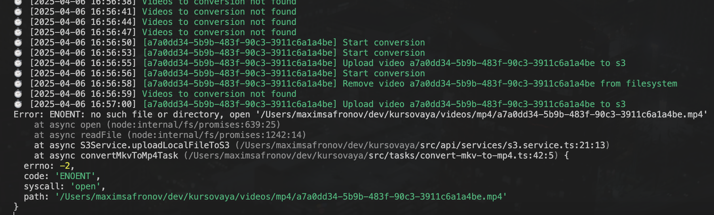

# Getting started

```
npm i                   # Install dependencies
cp .env.example .env    # Fill environment config
docker-compose up -d    # Get up database
npm run migrate:up      # Run migrations
brew install ffmpeg     # On macos, or download with another comand on your system
npm run dev             # Run project
```

## How create migration with knex?

```
knex migrate:make migration_name -x ts
```

## How start program?

```
1. Run http server with: npm run dev
2. POST http://localhost:4001/video/convert (Pin in form-data any video.mkv)
3. Observe in console "Start conversion"
```

# What problem are we solving?

Get checkout (git checkout 82266a3) on branch and run program. As you can see that the program is not working correctly: the tasks overlap each other. In this case, consistency and reliability are lost

